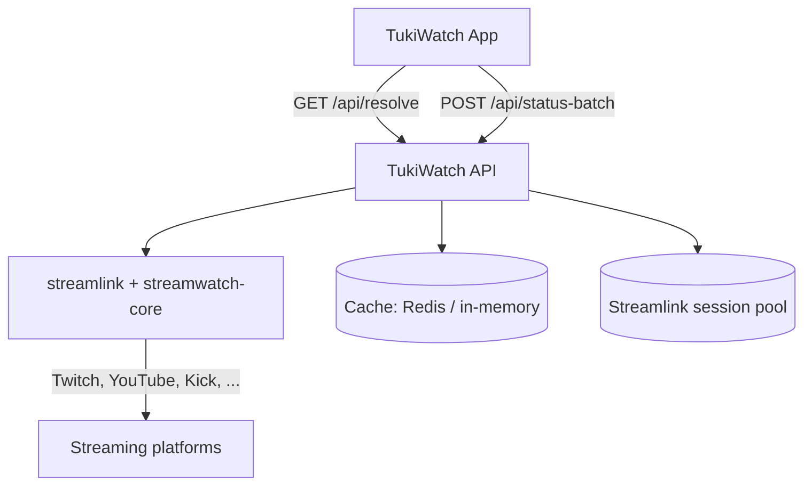

<div align="center">


# TukiWatch

**A privacy-first mobile app for tracking and watching live streams across platforms, backed by a self-hostable FastAPI backend.**

[](https://github.com/snowballons/tukiwatch/actions)
[](https://github.com/snowballons/tukiwatch/actions)
[](https://github.com/snowballons/tukiwatch/releases)
[](LICENSE)
[](https://github.com/snowballons/tukiwatch)

[Download APK](https://github.com/snowballons/tukiwatch/releases) · [Web download page](https://tukiwatch.snowballons.com/)

</div>

---

## Table of Contents

<!--
  This TOC is hand-maintained. If it drifts, regenerate with `doctoc README.md`
  (npx doctoc) or drop it and rely on GitHub's built-in table of contents.
-->

- [About](#about)
- [Why This Exists](#why-this-exists)
- [Features](#features)
  - [Screenshots](#screenshots)
- [Non-Goals](#non-goals)
- [Tech Stack](#tech-stack)
- [Architecture](#architecture)
- [Repository Structure](#repository-structure)
- [Related Repositories](#related-repositories)
- [Getting Started](#getting-started)
  - [Prerequisites](#prerequisites)
  - [Installation](#installation)
  - [Quick Start](#quick-start)
- [Usage](#usage)
- [Troubleshooting](#troubleshooting)
- [Configuration](#configuration)
- [API Reference](#api-reference)
- [Testing](#testing)
- [CI/CD](#cicd)
- [Deployment](#deployment)
- [Versioning & Changelog](#versioning--changelog)
- [Roadmap](#roadmap)
- [Project Status](#project-status)
- [Support](#support)
- [Contributing](#contributing)
- [Security](#security)
- [Credits & Acknowledgments](#credits--acknowledgments)
- [Author](#author)
- [License](#license)

---

## About

For live-stream fans, **TukiWatch** helps you track and watch your favorite
streamers across platforms in one place, by resolving stream URLs and checking
live status through a lightweight, self-hostable backend.

- **App** — [Expo](https://expo.dev/) (React Native) mobile app: add favorites,
  see who's live, and play streams in-app. See [`app/README.md`](app/README.md).
- **API** — [FastAPI](https://fastapi.tiangolo.com/) backend that resolves
  streams and batch-checks status via https://streamlink.github.io/.
  See [`api/README.md`](api/README.md).

---

## Why This Exists

Streamers are spread across Twitch, YouTube, Kick, Facebook, TikTok, and dozens
of smaller platforms. Fans juggle multiple apps and tabs just to know who is
live right now — and most "tracker" apps demand accounts, cloud sync, and
advertising.

TukiWatch takes the opposite approach:

- **Local-first.** Favorites live in an on-device SQLite database. No accounts,
  no cloud, no data collection.
- **Bring your own backend.** Point the app at any self-hosted TukiWatch API
  instance via QR code or deep link — no rebuild required.
- **Ad-free where the platform allows.** With a Twitch Turbo token configured on
  the backend, Twitch streams play without ads.
- **Open and self-contained.** The app builds on the shared
  [streamwatch-core](https://github.com/snowballons/streamwatch-core) domain
  package, also used by [streamwatch-cli](https://github.com/snowballons/streamwatch-cli).

---

## Features

- **Live Now** — one tab that shows only the favorites currently online, with
  search, platform filter chips, and pull-to-refresh.
- **Stream library (My List)** — every saved favorite with its live state
  (online / offline / error), plus full add/remove management.
- **Add streams from 20+ platforms** — pick a platform, type a channel or URL,
  and the app builds and verifies it against the backend before saving.
- **In-app player** — native video playback with a quality switcher, picture-in-
  picture, and "open in official app" deep links (Twitch, YouTube, Instagram,
  Facebook, TikTok, VK, …).
- **Self-hosted backend connect** — switch the app to your own API by scanning a
  QR code or opening a `tukiwatch://connect` deep link.
- **In-app updates** — checks a version manifest (`version.json`) and downloads
  the latest APK.
- **Export / import favorites** — share your list as JSON.
- **Dark-only UI** with onboarding, a custom branded splash, and a privacy-first
  posture.

### Screenshots

| Platform | Preview                                                                                           |
|:-------- |:------------------------------------------------------------------------------------------------- |
| Android  |  |

---

## Non-Goals

- **No accounts or cloud sync** — favorites are intentionally device-local.
- **No notifications (yet)** — see the [Roadmap](#roadmap).
- **No iOS release (yet)** — Android only today; iOS is planned.
- **Not a general-purpose media player** — TukiWatch tracks and plays live
  streams; it is not a streaming platform itself.
- **No web app** — the web site is a download/landing page, not a client.

---

## Tech Stack

| Component  | Technology                                                                                                                                                                                                                                                                                                                                     |
|:---------- |:---------------------------------------------------------------------------------------------------------------------------------------------------------------------------------------------------------------------------------------------------------------------------------------------------------------------------------------------- |
| App        | [Expo](https://expo.dev/) SDK 56 · [React Native](https://reactnative.dev/) 0.85 · [React](https://react.dev/) 19 · TypeScript · [expo-video](https://docs.expo.dev/versions/latest/sdk/video/) · [expo-sqlite](https://docs.expo.dev/versions/latest/sdk/sqlite/) · [React Navigation](https://reactnavigation.org/) · [Bun](https://bun.sh/) |
| Backend    | [Python](https://www.python.org/) 3.10–3.12 · [FastAPI](https://fastapi.tiangolo.com/) · [streamlink](https://streamlink.github.io/) · [streamwatch-core](https://github.com/snowballons/streamwatch-core) · [Redis](https://redis.io/) (optional) · [uv](https://docs.astral.sh/uv/)                                                          |
| CI/CD      | [GitHub Actions](https://github.com/features/actions) · [EAS Build](https://docs.expo.dev/build/introduction/)                                                                                                                                                                                                                                 |
| Deployment | [Docker](https://www.docker.com/) · [Railway](https://railway.app/)                                                                                                                                                                                                                                                                            |

---

## Architecture



**Components**

- **App** — Expo / React Native client. Resolves stream URLs, batch-checks the
  status of favorites, and plays streams in-app.
- **API** — stateless FastAPI service. No database; the only state is an
  ephemeral cache (Redis or in-memory fallback) and a recycled streamlink
  session pool.
- **streamwatch-core** — shared domain logic (rules, resolvers) installed as a
  pip dependency and shared with `streamwatch-cli`.

---

## Repository Structure

```
tukiwatch/
├── app/     # Expo (React Native) mobile application
├── api/     # FastAPI backend service
├── docs/    # Documentation (incl. self-hosting guide)
├── .github/ # CI/CD workflows
├── LICENSE
└── README.md
```

---

## Related Repositories

- [streamwatch-core](https://github.com/snowballons/streamwatch-core) — shared
  core library (rules, resolvers) used by the API and the CLI
- [streamwatch-cli](https://github.com/snowballons/streamwatch-cli) — command-
  line interface for resolving and watching streams

---

## Getting Started

### Prerequisites

- **App:** [Bun](https://bun.sh/) ≥ 1.x (Node.js comes via the Expo toolchain)
- **API:** [Python](https://www.python.org/) 3.10+ and [uv](https://docs.astral.sh/uv/)
- **Optional:** [Redis](https://redis.io/) for a shared API cache (the API falls
  back to an in-memory cache without it)

### Installation

```bash
# 1. Clone the repository
git clone https://github.com/snowballons/tukiwatch.git
cd tukiwatch

# 2. Install the API
cd api
cp .env.example .env   # set ALLOWED_ORIGINS, optionally Redis/Twitch token
uv sync --all-groups

# 3. Install the app
cd ../app
cp .env.example .env   # set EXPO_PUBLIC_API_URL (optional)
bun install
```

### Quick Start

```bash
# Run the API
cd api
uv run uvicorn main:app --host 0.0.0.0 --port 8000

# Run the app (new terminal)
cd app
bun run start
```

Verify the API is up, then open the app:

```bash
curl http://localhost:8000/health
# {"status":"healthy","service":"streamlink-api"}
```

---

## Usage

- **App** — features, navigation, data layer, and release flow:
  [`app/README.md`](app/README.md)
- **API** — endpoints, response shapes, configuration, and internals:
  [`api/README.md`](api/README.md)
- **Self-hosting** — Docker, Railway, and connecting the app to your own
  instance: [`docs/SELF_HOSTING.md`](docs/SELF_HOSTING.md)

---

## Troubleshooting

<details>
  <summary><b>App can't reach the backend</b></summary>

  **Cause:** `EXPO_PUBLIC_API_URL` points at an unreachable host, or the API
  isn't running.
  **Fix:** Confirm the API is up (`curl http://localhost:8000/health`), then
  either fix `app/.env` and rebuild, or switch the backend at runtime via
  **Settings → Backend → Scan QR Code**.

</details>

<details>
  <summary><b>"Browser dependency required" when resolving a stream</b></summary>

  **Cause:** Some platforms (e.g. Twitch) use anti-bot protection that
  streamlink cannot bypass headlessly.
  **Fix:** This is a known streamlink limitation for specific URLs — the API
  returns a structured `error_details` so the app can explain it. Try the
  platform's own app, or open the stream in a browser.

</details>

<details>
  <summary><b>docker compose fails with a build-context error</b></summary>

  **Cause:** An old `docker-compose.yml` referenced an absolute local path.
  **Fix:** Pull the latest version — the compose file now uses a relative
  `./api` build context that works on any machine.

</details>

---

## Configuration

| Variable                          | Where | Description                                 | Required | Default                                          |
|:--------------------------------- |:----- |:------------------------------------------- |:--------:|:------------------------------------------------ |
| `ALLOWED_ORIGINS`                 | API   | Comma-separated CORS origins                | No       | `*`                                              |
| `TWITCH_OAUTH_TOKEN`              | API   | Ad-free Twitch streams (Twitch Turbo)       | No       | —                                                |
| `REDIS_URL` / `REDIS_*`           | API   | Ephemeral cache (omit for in-memory)        | No       | in-memory                                        |
| `EXPO_PUBLIC_API_URL`             | App   | Default backend URL (build-time)            | No       | `http://localhost:8000/`                         |
| `EXPO_PUBLIC_UPDATE_MANIFEST_URL` | App   | URL of the update manifest (`version.json`) | No       | `https://downloads.snowballons.com/version.json` |

Copy `api/.env.example` → `api/.env` and `app/.env.example` → `app/.env` and
fill in the values. See [`docs/SELF_HOSTING.md`](docs/SELF_HOSTING.md) for the
full story, including the runtime QR-code flow.

---

## API Reference

| Endpoint                 | Method | Description                                          |
|:------------------------ |:------ |:---------------------------------------------------- |
| `/api/resolve?url=<url>` | `GET`  | Resolve a stream URL to playable streams + metadata  |
| `/api/status-batch`      | `POST` | Batch-check stream status (body: `{"urls": [...]}`)  |
| `/health`                | `GET`  | Liveness probe (used by the app to verify a backend) |

Both endpoints support `?bypass_cache=true`. Full details, request/response
examples, and extra stats endpoints are in [`api/README.md`](api/README.md).

---

## Testing

```bash
# API — lint + tests
cd api
uv run ruff check .
uv run pytest

# App — lint/format + type check
cd app
bunx @biomejs/biome ci .
bun run type-check
```

---

## CI/CD

GitHub Actions workflows live in [`.github/workflows/`](.github/workflows):

| Workflow              | Triggers                        | Checks / Output                                                                            |
|:--------------------- |:------------------------------- |:------------------------------------------------------------------------------------------ |
| `api.yml`             | Changes under `api/**`          | uv sync, ruff, pytest (Python 3.10–3.12)                                                   |
| `app.yml`             | Changes under `app/**`          | bun install, biome ci, type-check                                                          |
| `release-android.yml` | Manual dispatch (version input) | Builds an Android APK via EAS, creates a GitHub Release, bumps `version.json` + `app.json` |

---

## Deployment

- **Docker Compose** — from the repo root: `cp api/.env.example .env && docker compose up -d`
  (builds `api/`, exposes port `8000`).
- **Railway** — create a service from the repo, set the **root directory** to
  `api/`; Railway auto-detects `nixpacks.toml` and `requirements.txt`.

Full instructions for both, plus pointing the app at your instance, live in
[`docs/SELF_HOSTING.md`](docs/SELF_HOSTING.md).

---

## Versioning & Changelog

This project follows [Semantic Versioning](https://semver.org/). Changes are
documented in [CHANGELOG.md](CHANGELOG.md). The app's update channel uses a
`version.json` manifest + GitHub Releases (see [`app/README.md`](app/README.md)).

---

## Roadmap

Planned — not yet implemented:

- **Live notifications** — alert when a favorite streamer goes live
- **Trending & discovery** — browse trending streams, recommendations
- **Custom alerts** — preferences for stream quality, categories, and
  notification types
- **Offline mode** — view saved stream info and history without internet
- **iOS release**
- **Web client**

---

## Project Status

**Status:** Active development.

Android v1.0.5 is released (APK via GitHub Releases); iOS is planned. The API
and app are actively maintained.

---

## Support

- **Bug reports & feature requests:** [GitHub Issues](https://github.com/snowballons/tukiwatch/issues)
- **Questions & discussions:** [GitHub Discussions](https://github.com/snowballons/tukiwatch/discussions)
- **Email:** tukiwatch@snowballons.com

---

## Contributing

Contributions are welcome. Start with [`app/CONTRIBUTING.md`](app/CONTRIBUTING.md)
and the repository's [`AGENTS.md`](AGENTS.md), then:

1. [Open an issue](https://github.com/snowballons/tukiwatch/issues/new) to
   discuss the change first (or pick an existing one).
2. **Fork** the repo and create a feature branch (`feat/...`, `fix/...`).
3. Make your changes and **run the quality gates** (see [Testing](#testing)).
4. Use clear, conventional commit messages (`feat:`, `fix:`, `docs:`,
   `refactor:`).
5. Open a **Pull Request** referencing the issue ("Closes #12").

---

## Security

- The API is **stateless and unauthenticated** — anyone who can reach the
  backend URL can use it. Rate limiting still applies, but protect the service
  at the network level (firewall / private tunnel) if you want to restrict
  access.
- No user data is stored server-side; favorites live on-device in the app.
- To report a vulnerability, email **tukiwatch@snowballons.com** — do **not**
  open a public issue for security bugs.

---

## Credits & Acknowledgments

- [streamlink](https://streamlink.github.io/) — stream resolution engine
- [streamwatch-core](https://github.com/snowballons/streamwatch-core) — shared
  domain package
- [Expo](https://expo.dev/) / [React Native](https://reactnative.dev/) — app
  framework

---

## Author

**Snowballons** — [GitHub](https://github.com/snowballons) ·
tukiwatch@snowballons.com

---

## License

This project is licensed under the [MIT License](LICENSE) (SPDX: MIT) —
Copyright (c) 2026 Snowballons.
